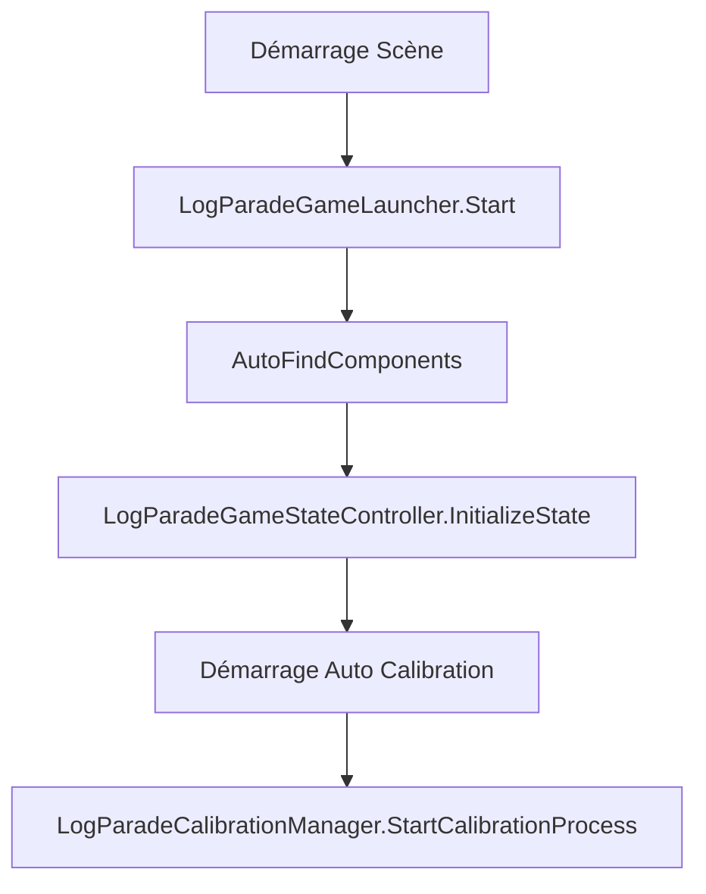
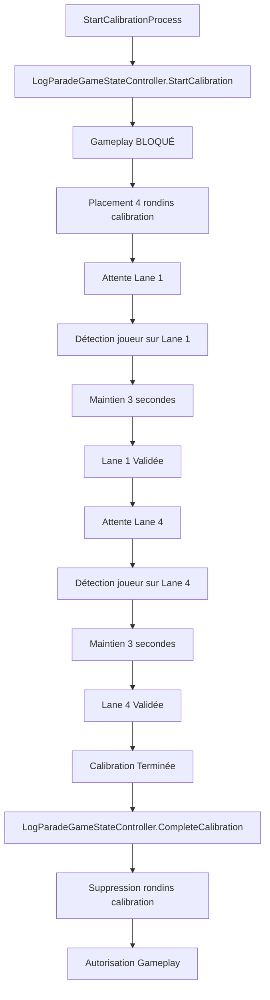
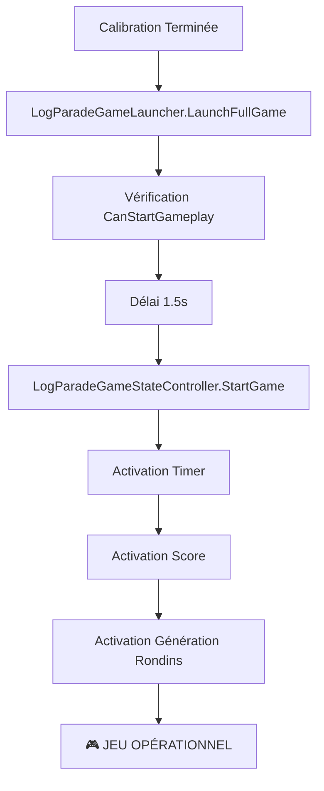

# 🌀 📍 Workflow Complet du Mini-Jeu LogParade

## 🎯 Vue d'ensemble du Système

Le mini-jeu LogParade suit un **workflow strict et obligatoire** centré autour d'une **calibration préalable** avant tout démarrage de jeu. Ce document détaille l'architecture complète et le flux d'exécution.

---

## 🎬 Workflow Global : Étapes Obligatoires

### 1. 🧭 Phase de Calibration (OBLIGATOIRE)

**🚫 RÈGLE FONDAMENTALE : Aucun gameplay n'est possible sans calibration terminée**

#### Processus de Calibration :

1. **Initialisation** :
   - Le `LogParadeGameLauncher` démarre automatiquement la calibration
   - Le `LogParadeGameStateController` bloque tout gameplay
   - 4 rondins de calibration sont placés sur toutes les lanes

2. **Étape 1 - Lane 1** :
   - 📍 Instructions affichées : "Allez sur la lane 1"
   - 🔵 Le rondin de la lane 1 s'illumine en bleu
   - ⏱️ Le joueur doit rester 3 secondes stables sur la lane 1
   - ✅ Validation automatique après 3 secondes

3. **Étape 2 - Lane 4** :
   - 📍 Instructions affichées : "Allez sur la lane 4"
   - 🔵 Le rondin de la lane 4 s'illumine en bleu
   - ⏱️ Le joueur doit rester 3 secondes stables sur la lane 4
   - ✅ Validation automatique après 3 secondes

4. **Finalisation** :
   - 🧹 Suppression automatique des rondins de calibration
   - ✅ `LogParadeGameStateController.CompleteCalibration()` appelé
   - 🎮 Autorisation de démarrage du gameplay

### 2. ⏱️ Transition vers le Jeu (2 secondes)

- **Compte à rebours de 2 secondes** affiché à l'écran
- Préparation des systèmes de jeu
- **Aucun système de scoring/timing actif pendant cette phase**

### 3. 🎮 Lancement du Jeu Principal

- **Timer activé** (`LogParadeGameTimer`)
- **Score activé** (`LogParadeScoreManager`)
- **Génération de rondins activée** (`LogParadeLogGenerator`)
- Gameplay complet opérationnel

---

## 🏗️ Architecture des Composants

### 🎮 Composants Principaux

| Composant | Rôle | Phase Active |
|-----------|------|--------------|
| `LogParadeGameLauncher` | Orchestrateur central | Toujours |
| `LogParadeCalibrationManager` | Gestion calibration | Calibration uniquement |
| `LogParadeCalibrationInteractive` | Calibration interactive | Calibration uniquement |
| `LogParadeGameStateController` | Contrôle d'état global | Toujours |
| `LogParadeGameTimer` | Gestion du temps de jeu | Gameplay uniquement |
| `LogParadeScoreManager` | Gestion du score | Gameplay uniquement |
| `LogParadeLogGenerator` | Génération des rondins | Gameplay uniquement |

### 🔄 Gestionnaires d'État

#### `LogParadeGameStateController` (Statique)
```csharp
// États globaux
public static bool IsCalibrationInProgress { get; private set; }
public static bool IsGameplayAllowed { get; private set; }
public static bool IsGameStarted { get; private set; }

// Méthodes de contrôle
public static void StartCalibration()
public static void CompleteCalibration()
public static void StartGame()
public static bool CanStartGameplay()
public static bool CanStartScoring()
```

#### `LogParadeCalibrationStateManager`
```csharp
public enum CalibrationState
{
    NotStarted,
    WaitingForLane1,
    HoldingOnLane1,    // 3 secondes de maintien
    Lane1Completed,
    WaitingForLane4,
    HoldingOnLane4,    // 3 secondes de maintien
    Completed,
    Failed
}
```

---

## 🚀 Flux d'Exécution Détaillé

### Phase 1 : Initialisation


### Phase 2 : Calibration


### Phase 3 : Lancement du Jeu


---

## 🔒 Verrous et Sécurités

### ❌ Blocages Pendant la Calibration
- **Timer** : `LogParadeGameTimer` ne peut pas démarrer
- **Score** : `LogParadeScoreManager` ne peut pas scorer
- **Rondins** : `LogParadeLogGenerator` ne génère rien
- **Gameplay** : Toute tentative est rejetée

### ✅ Conditions de Démarrage
```csharp
// Pour démarrer le scoring
public static bool CanStartScoring()
{
    return IsGameplayAllowed && !IsCalibrationInProgress;
}

// Pour démarrer le gameplay
public static bool CanStartGameplay()
{
    return IsGameplayAllowed && !IsCalibrationInProgress;
}
```

---

## 🎨 Feedback Visuel et UI

### 🔵 Feedback Visuel de Calibration
- **Rondins de calibration** : Même prefab que le jeu, placé sur les 4 lanes
- **Surbrillance bleu** : Lane active pendant la calibration
- **Changement de couleur** : Vert lors de la validation

### 📺 Interface Utilisateur
- **CalibrationTextUI** : Affichage des instructions
- **Compte à rebours** : Timer visuel pendant le maintien (3 secondes)
- **Messages d'état** : "Allez sur la lane X", "Validation...", etc.

---

## 🐛 Gestion d'Erreurs et Debug

### 🔍 Vérifications de Robustesse

1. **Validation des Références** :
```csharp
private bool ValidateReferences()
{
    // Vérification que toutes les lanes sont assignées
    // Vérification de la présence du CalibrationTextUI
    // Vérification du prefab de rondin
}
```

2. **Auto-Assignment** :
```csharp
private void AutoFindComponents()
{
    if (gameController == null)
        gameController = FindFirstObjectByType<LogParadeGameController>();
    // ... pour tous les composants
}
```

3. **States de Sécurité** :
```csharp
// Impossible de démarrer le jeu sans calibration
if (!LogParadeGameStateController.CanStartGameplay())
{
    LogWarning("Tentative de démarrage sans calibration terminée");
    return;
}
```

### 🐛 Messages de Debug
- **LogParadeLogger** : Système de logging unifié
- **Verbose logs** : Activables via inspecteur
- **Context menus** : `[ContextMenu("Debug State")]` pour inspection

---

## ⚙️ Configuration et Setup

### 📋 Setup Minimal Requis

#### GameObject Principal : `GameManager`
```
GameManager
├── LogParadeGameLauncher ⭐
├── LogParadeCalibrationManager ⭐  
├── LogParadeGameStateController ⭐
├── LogParadeGameController
├── LogParadeGameTimer
├── LogParadeScoreManager
├── LogParadeLogGenerator
└── LogParadeUIManager
```

#### GameObject de Calibration : `CalibrationSystem`
```
CalibrationSystem
├── LogParadeCalibrationInteractive ⭐
├── LogParadeCalibrationPlayerDetector
├── LogParadeCalibrationVisualFeedback
├── LogParadeCalibrationUIManager
└── CalibrationTextUI ⭐
```

### 🔧 Paramètres Importants

| Paramètre | Valeur | Description |
|-----------|--------|-------------|
| `delayAfterCalibration` | 1.5f | Délai avant lancement du jeu |
| `LANE_HOLD_DURATION` | 3f | Temps de maintien par lane |
| `timeoutDuration` | 15f | Timeout de calibration |
| `autoStartCalibrationOnStart` | true | Démarrage auto |

---

## 🚨 Points Critiques à Retenir

### ⚠️ RÈGLES ABSOLUES
1. **Pas de jeu sans calibration** - Verrous stricts
2. **Même prefab pour calibration et jeu** - Cohérence visuelle
3. **4 lanes obligatoires** - Lane 1 et 4 minimum pour calibration
4. **3 secondes de maintien** - Stabilité du joueur
5. **Feedback visuel obligatoire** - Guidage du joueur

### 🔄 Ordre d'Exécution Strict
```
1. Initialisation système
2. Démarrage calibration automatique
3. Calibration lane 1 (3s)
4. Calibration lane 4 (3s)
5. Nettoyage rondins calibration
6. Délai de transition (1.5s)
7. Lancement jeu complet
8. Activation timer/score/génération
```

### 🎯 Vérifications de Bon Fonctionnement
- [ ] Calibration démarre automatiquement
- [ ] Rondins de calibration s'affichent sur toutes les lanes
- [ ] Lane 1 se surligne en bleu lors de l'instruction
- [ ] Détection et maintien 3s sur lane 1
- [ ] Lane 4 se surligne en bleu lors de l'instruction  
- [ ] Détection et maintien 3s sur lane 4
- [ ] Suppression des rondins de calibration
- [ ] Compte à rebours de 2s affiché
- [ ] Timer/Score/Génération démarrent ensemble
- [ ] Aucun système de scoring actif pendant calibration

---

## 🔧 Maintenance et Evolution

### 📈 Ajouts Futurs Possibles
- **Calibration additionnelle** : Lanes 2 et 3
- **Calibration personnalisée** : Durées variables
- **Système de sauvegarde** : Mémorisation des calibrations
- **Multi-joueurs** : Calibration simultanée

### 🔒 Points de Vigilance
- **Thread safety** : GameStateController utilise des statiques
- **Lifecycle** : Proper cleanup lors des changements de scène
- **Performance** : Éviter les FindObjectByType répétés

---

## 🎯 Conclusion

Le système LogParade implémente un **workflow robuste et sécurisé** garantissant qu'aucun gameplay ne peut démarrer sans une calibration complète et validée. L'architecture modulaire permet une maintenance facile tout en assurant la cohérence de l'expérience utilisateur.

**L'ordre strict Calibration → Transition → Gameplay est respecté et verrouillé par design.**
